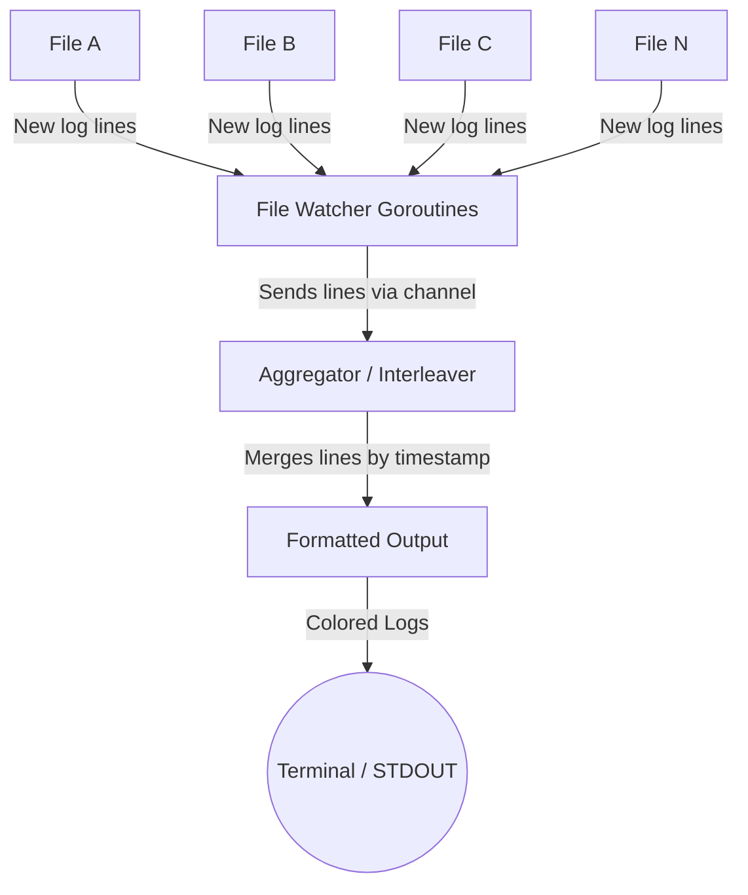

<div align="center">
  <h1><code>kitsune</code></h1>

  <p><b>A concurrent log multiplexer that interleaves real-time log streams with minimal I/O overhead.</b></p>
</div>

> [!WARNING]
> **This project is in its early stages and may undergo many breaking changes in the future.**

## Requirements and Challenges

* **Multiple File Tail** – Monitor many log files in parallel (tens of files, each with potentially hundreds of thousands of lines) and continuously stream new lines as they are appended. The tool should handle new data in near real-time without missing lines.
* **High-Frequency Updates** – Efficiently handle rapid append rates (hundreds of writes per second per file). The solution must avoid CPU-intensive polling loops and minimize I/O overhead so it can keep up with thousands of log lines per second in total.
* **Log Rotation** – Gracefully handle log file rotations. If a log file is renamed or truncated as part of rotation (e.g. via logrotate), the tool should seamlessly continue following the new file or reset to the beginning of the truncated file, without losing data or hanging on an old file.
* **Interleaved Output** – Combine entries from multiple files into a single unified output stream. Lines from different files should be interleaved in a logical order (e.g. chronological by timestamp or arrival time) rather than printed in separate blocks. This helps correlate events across systems.
* **Color-Coded Sources** – Differentiate log sources in the output. Each file’s lines should be labeled (by color or prefix) so the reader can identify their origin at a glance. Colorizing must be done in a way that doesn’t interfere with log text or sorting.
* **Performance and Efficiency** – Use minimal CPU and memory. Avoid busy-waiting or reading unnecessary data. The design should use asynchronous, event-driven techniques (like Linux inotify) and Go’s concurrency to maximize throughput. It should also allow tuning internal parameters (buffers, batching, etc.) for different performance needs.
* **Standalone CLI** – Implement as a self-contained Go binary with no special dependencies, usable from a terminal. It should handle typical terminal behavior (e.g. stop coloring if output is piped to another program or file) and clean up resources on exit.

## Architecture Overview

To meet these requirements, the tool uses an event-driven, producer/consumer architecture with Go routines and channels:

* **File Watchers**: Each log file is monitored using Linux filesystem notifications (inotify via Go’s `fsnotify` library). This provides immediate triggers when a file is written to or rotated, instead of polling. With inotify, output can be updated very promptly on file changes. Each file watcher runs in its own goroutine to allow concurrent processing of multiple files.

* **Concurrent Readers**: When a file-change event occurs, a goroutine dedicated to that file will read the newly appended data from the file. Reading is done in a buffered, efficient manner to handle bursts of writes. The new log lines are then sent to a central aggregator (via channels).

* **Aggregator & Interleaver**: A central component receives incoming lines from all file goroutines and merges them into a single output stream. It interleaves lines based on an ordering strategy (for example, by timestamp) to maintain a coherent chronology across sources. This aggregator ensures that only one goroutine actually writes to the terminal at a time (to avoid jumbled output), and it tags each line with a color or label for its source.

* **Output Renderer**: The final stage adds color coding and prints the line to the console (STDOUT). Color codes are chosen per file (e.g. file1=red, file2=blue, etc.) using ANSI escape sequences. This gives a live, colorized view of all logs combined.

Below is a high-level diagram of the data flow:



Each file has an independent watcher/reader, ensuring I/O waits or delays on one file do not block others. The aggregator merges and orders lines, then outputs them with appropriate color labeling.

## File Monitoring with Inotify

Instead of continuously polling files for changes, the tool uses inotify on Linux to get event-driven notifications when a file is modified or rotated. In Go, this is accomplished with the `fsnotify` package for cross-platform file system notifications. We create an inotify watcher and add each target log file to it. For example:

```go
watcher, err := fsnotify.NewWatcher()
if err != nil {
    log.Fatal(err)
}
for _, file := range files {
    err = watcher.Add(file)
    if err != nil {
        log.Fatal(err)
    }
}
```

This registers interest in events for each file. We then listen on `watcher.Events` channel in separate goroutines or a multiplexing loop. Whenever an event indicates a file was written to, we can react immediately. For instance:

```go
for event := range watcher.Events {
    if event.Op&fsnotify.Write == fsnotify.Write {
        fmt.Println("modified file:", event.Name)
        // signal the corresponding file-reader goroutine to read new data
    }
    // Also handle fsnotify.Create, fsnotify.Rename, fsnotify.Remove as needed for rotations
}
```

Using inotify ensures the tool is **prompt and efficient**. The kernel will notify us as soon as new content is available, unlike polling which might miss rapid updates or impose delays. According to the GNU Coreutils manual, with kernel inotify support, tailing output is triggered by file changes and is “generally very prompt”. We avoid the 1-second sleep intervals that `tail -f` uses in polling mode, resulting in real-time responsiveness.

**Resource usage**: inotify is very lightweight per file. Each watch consumes on the order of a kilobyte of kernel memory, so watching even dozens of files is negligible. The default Linux inotify limits (e.g. max 8192 watches) can handle our use case, and can be raised via sysctl if needed.

## Concurrent Log Reading and Buffering

Each file being tailed is handled by a dedicated Go routine that waits for “read signals” (notifications) and then reads new data. This separation (one goroutine per file) leverages Go’s concurrency to read multiple files in parallel, which is important if many logs are written simultaneously. It also prevents a slow I/O on one file from blocking others.

**Async I/O Model**: Although Go’s file reads are synchronous, we simulate asynchronous behavior by using goroutines. Upon receiving an inotify write event for a file, the file’s goroutine will do the following:

* **Seek to the last read position** in the file (the goroutine tracks how much of the file has been read so far).
* **Read any new bytes** appended since the last position. This can be done with a buffered reader (`bufio.Reader`) or using `os.File.Read` into a byte slice. We read in chunks (e.g. 4KB or 8KB at a time) to efficiently handle large writes.
* **Split** the read chunk into individual lines (by newline delimiter). Any partial line at the end of the chunk is saved and combined with the next read.
* **Send** complete lines to the aggregator via a channel, including metadata of which file they came from (and possibly a timestamp if we plan to sort).

By reading all available new data in a loop until end-of-file, we ensure we catch up on bursts of log entries in one go. This is more efficient than treating each line or small write as a separate event – it reduces system call overhead when logs are written in large blocks. The approach is similar to how Fluent Bit’s log tailer reads data in chunks: e.g. it starts with a 32KB buffer and grows if needed. We can allow configuring the buffer size and a maximum limit to avoid memory bloat on extremely long lines. For instance, an initial buffer of 8KB that can grow to, say, 64KB per file is a reasonable default (Fluent Bit uses 32KB by default). This means even if a single log line is very large, the tool can accommodate it up to the max buffer size without dropping data.

**Memory Efficiency**: The tool does not load entire files into memory – it only keeps a small buffer per file for new data and perhaps a few recent lines for sorting. Even if a file has millions of lines, we are only concerned with the tail growth. Each goroutine maintains state like the current file offset and a buffer for the current line being read. This keeps memory usage low and proportional to activity.

**Concurrency Considerations**: Communication between goroutines is done via channels, which are thread-safe and idiomatic in Go. For example, each file goroutine could have an output channel for new lines. The aggregator can use a `select` or multiple channel reads to pull lines as they arrive. This design avoids explicit locking; the Go scheduler will manage parallelism. We should, however, guard the actual terminal output with a mutex or funnel it through a single channel to preserve line atomicity (more on this in the Interleaving section).

Additionally, Go’s runtime is efficient at handling many goroutines (each has small stack and minimal context switching overhead). Dozens of goroutines will not be an issue – this structure can scale to even hundreds of files if needed.

## Handling Log Rotation Gracefully

Log rotation is a tricky aspect of implementing `tail -f`. We need to detect when a file has been rotated (renamed, moved, or truncated) and then continue tailing the “new” log file seamlessly. The tool will implement logic analogous to `tail -F` (which “follows by name” and retries) to be robust against rotations.

**Detecting Renames and Moves**: When a log file is rotated via rename (common pattern: `app.log` is renamed to `app.log.1` and a new `app.log` is created), an inotify watch on the original file path can signal events like `fsnotify.Rename` or `fsnotify.Remove`. However, because the file was renamed, an inotify watch set on that file descriptor might stop reporting further writes (since the writing process typically opens a new file). To handle this:

* We also add watches on the **directory** containing the files, so we get notified of a new file creation with the original name. The sequence of events on rotation might be: the old file is renamed (or removed), then a new file with the same name is created. By watching the directory, we catch the Create event for the new file name.
* Once we detect the new file, we can re-open it and continue reading from it. The file-specific goroutine can close its old file descriptor and start reading from the new one (starting at offset 0, since it’s a fresh file).

Using inotify for this means we don’t have to poll the filesystem waiting for the file to reappear – the kernel will notify us immediately. In fact, the GNU tail implementation notes that the inotify-based approach can handle renamed files without needing periodic checks​
gnu.org
. We will follow the filename (not just the inode) so that even if the inode changes (on rotation), we continue on the new file.

**Detecting Truncation (Copy-Truncate Rotation)**: Some log rotation schemes copy the log to a backup and then truncate the original file to zero length (instead of renaming it). In this case, the file path stays the same, but the content is cleared. Our tool can detect this by noticing that the file size suddenly shrank or an inotify `Truncate`/`Write` event followed by a size drop. The action to take is similar to `tail` – print a message or internally note that the file was truncated and reset the read offset to the new end (which is the beginning of the file). After truncation, any new writes to the file should be read from offset 0 onward. In practice, we can simply detect if the current read offset is now beyond the new file size (indicating the file was cut) and reset our offset to the new end-of-file.

In summary, the rotation handling logic per file goroutine will be:

* If an `fsnotify.Remove`/`Rename` event is received for the file path:
    * Close the current file (its inode is likely stale).
    * Enter a retry loop to open the file by name (in case the new file isn’t created instantly). This is analogous to tail’s `--retry` behavior. Using inotify on the directory, we’ll likely get the `Create` event quickly, so we can reopen without polling every second.
    * Once opened, start reading from the beginning of the new file (but do not re-print the old content that might be still in it from before rotation if copy-truncate was used — usually copy-truncate empties it, and rename yields a fresh file).
* If an `fsnotify.Write` event is received but the file size is less than the last read offset (file shrank):
    * Treat it as a truncation. Print a diagnostic message (optional) that the file was truncated, and reset internal offset to 0 (start of file).
    * Read any new content (if any) from the new start position.

This ensures long-running tailing won’t break when logs rotate. The user will see a continuous stream as if the log never switched (maybe with an informative notice if desired, similar to how `tail` outputs “file truncated”).

**Edge Cases**: If a file is rotated and not immediately replaced, our directory watch will catch when it does appear. If a file is deleted and not recreated, the tool can optionally warn or keep trying (configurable retry interval). In most logrotate setups, the new file is created instantly by the logging process or by logrotate itself (especially if using the `copytruncate` method, the file remains with same name). Our approach covers both scenarios reliably.

## Fast Log Interleaving Strategy

One of the core features is merging log lines from multiple sources into a single, chronologically ordered stream. A naive approach would print lines from each file as they arrive, but this could result in jumbled time order or one chatty log dominating the output for a while. Instead, we implement an **optimized interleaving**:

* **Timestamp-Based Ordering**: If the log lines contain timestamps (as most do), we can parse each line’s timestamp (at least up to seconds or milliseconds resolution) and use it as a key for ordering. The aggregator goroutine can maintain a **min-heap/priority queue** of the next available line from each file, ordered by timestamp. It repeatedly picks the earliest timestamp line and prints it, then inserts the next line from that file into the heap, and so on. This effectively merges the sorted streams akin to a k-way merge algorithm. Each log file is individually time-sorted, so this merge is efficient. Even with dozens of files, a heap of that size is trivial to handle. This approach ensures global chronological order of events in the output.

* **Real-Time Considerations**: In a live setting, we won’t always have a next line from every file ready. The aggregator can choose to wait until at least one new line is present and output it. Perfect ordering would require waiting for slower sources, so there’s a trade-off. In practice, we can achieve near-chronological output: whenever a new line comes in, we know its timestamp; we can safely print any buffered lines that have an earlier timestamp. If one source is lagging significantly, the newer lines will simply appear when they arrive (potentially slightly out of global order). This is generally acceptable in a live view. We assume log timestamps are reasonably synchronized (e.g. all servers use NTP) if true ordering is needed.

* **No Timestamps?** If logs lack timestamps or we choose not to parse them (to save CPU), we can fall back to ordering by arrival time. That is, as events come off the inotify and read pipelines, we intermix them. This usually correlates with actual order, though it’s not guaranteed if events are delayed. In many scenarios, simply printing lines as they are read (with maybe a round-robin servicing to avoid starvation) is sufficient. The design could allow configurable ordering: strict timestamp merge vs. simple interleaving. For the highest fidelity, we use the timestamp merge.

The chosen strategy is **high-performance**. Merging sorted streams is an O(n log k) operation per line (k = number of files), which for k in the tens is negligible. We only need to store a handful of lines in memory at a time (one or two per file for the heap). A similar idea was implemented in a Python script “liac” by a developer to interleave multiple logs: it sorts lines by a timestamp field and adds color tags per file​
blog.fraggod.net
. Our tool takes this concept and implements it in Go for speed and continuous streaming. The benefit is clear: you see a unified timeline of events. An example use-case described this as “an interleaved output from several timestamped log files, for events happening at nearly the same time (to establish the sequence between them and correlate output)”. In other words, if File A and File B are logging related events, you can directly see event A1, then B1, then A2, then B2 in the correct order, rather than reading A’s log then B’s.

To implement the merging cleanly, the aggregator goroutine can use a structure like:

```go
type LogLine struct {
    timestamp time.Time
    text      string
    source    string  // file name or identifier
}
minHeap := &LineHeap{}  // implement heap.Interface
heap.Init(minHeap)

// As lines come in (via channels or other mechanism):
for line := range incomingLines {
    heap.Push(minHeap, line)
    // If the heap’s size exceeds 1, pop and print as many lines as possible whose
    // timestamp is <= timestamp of the next line from other sources (or simply pop if buffer grows).
    // This part can be tuned for how long to buffer.
    for minHeap.Len() > 0 {
        next := heap.Pop(minHeap).(*LogLine)
        outputLine(next)
    }
}
```

The above is a simplified illustration. In practice, we might not print immediately on every single push, but rather have the aggregator loop constantly checking the heap. We also ensure thread-safety (only aggregator touches the heap). The `outputLine` function would handle coloring and writing to stdout.

If parsing timestamps for every line becomes a bottleneck at extremely high rates, we could make it optional. The parsing can be optimized by using precompiled regex or fixed offsets if the timestamp format is known. Still, Go’s time parsing is quite fast and likely not the slowest part (console output is).
